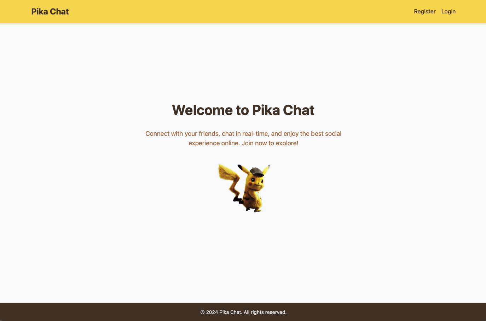
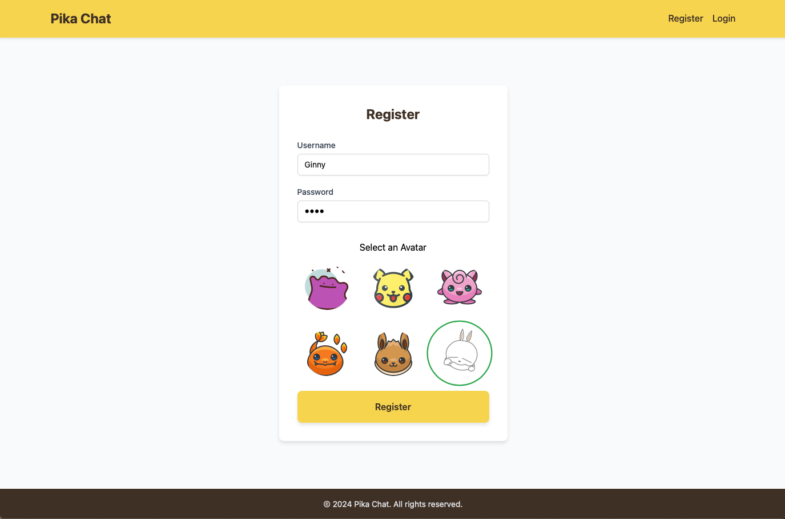
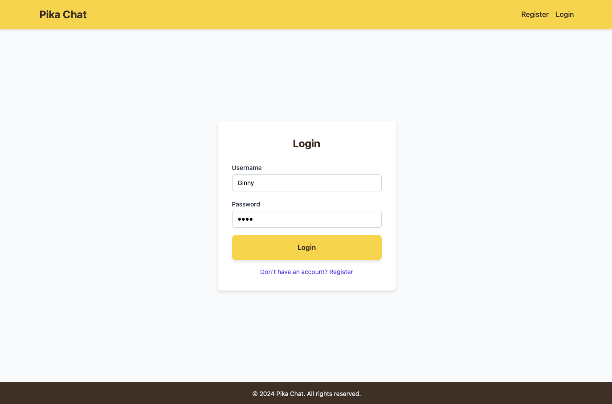
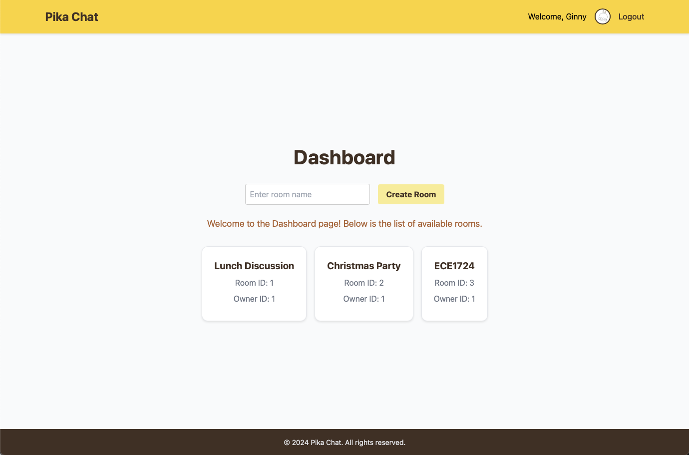

## Presented to you by the Pika's Team  

- **Ginny Ji** (mailto:ginny.ji@mail.utoronto.ca)  

- **Xinyi Gong** (mailto:x.gong@mail.utoronto.ca)
  
***
## Table of Contents 
- [User's Guide](#users-guide)
- [Video Demo](#video-demo)  
- [Features](#features)
- [Reproducibility Guide](#reproducibility-guide)
- [Motivation](#motivation)   
- [Objectives](#objectives)  
- [Contributions](#contributions)
- [Fun Fact: The Spirit Behind Pika Chat 🐾](#fun-fact)  

***

## User’s Guide  

Welcome to the real-time chat application! 🚀 This guide will help you get started quickly and make the most of the exciting features. Whether you're a user looking to chat or a developer exploring the project, follow these steps to dive in.  

### **1. Setup the Server and Client**  
Before starting, ensure you've set up the server and client following the instructions in the [Reproducibility Guide](#reproducibility-guide) section. Once you're ready, open your favorite browser and visit:  

👉 [http://localhost:3000/](http://localhost:3000/)  



### **2. Register Your Account** 📝  
- On the top-right corner, click **‘Register’** to create your account.  
- Fill in the form and choose your favorite avatar to personalize your profile. 🧑‍🎨  
- Once done, hit **‘Register’** and you're all set!  



### **3. Log In and Access Your Dashboard** 🔑  
- Woohoo! 🎉 Your account is ready.  
- Log in using the credentials you just created.  
- After logging in, you’ll land on the **Dashboard** page. You’ll see your name and avatar proudly displayed on the top-right corner.  



### **4. Create or Join Chat Rooms** 💬  
- Ready to chat? Click the **‘Create Room’** button to create a new chat room and give it a name.  
- If you'd rather join an existing chat room, simply select one from the list.  



### **5. Chat and Explore** 🚀  
- Once you join a chat room, you’ll see the **Room Member List** on the left panel. Each user’s online/offline status is displayed so you know who’s active.  
- Start chatting and enjoy the real-time messaging experience! 💬  


### **6. Log Out When Done** 👋  
- Finished chatting? Click the **‘Logout’** button on the top-right corner to securely sign out.  
- Come back anytime — your chatrooms and profile will be waiting for you!  


### **What’s Next?** 🌟  
Feel free to explore more, invite your friends, or customize your experience further. If you're a developer, dive into the codebase and explore how everything works under the hood.  

Happy chatting! 🥳✨  

***

<a id="video-demo"></a>  
## Video Demo: See Pika Chat in Action! 🎥  

Check out our short video demonstration to see Pika Chat in action! From user authentication to real-time messaging, this video walks you through all the features that make Pika Chat an engaging and fun experience.  

[Watch the Demo Here](https://youtu.be/7ebksLx-KNw)

***

## Features

### Key Features

### 1. **User Authentication**  
The project implements a secure user authentication system to ensure reliable and protected user access. This includes user sign-up, login, and session management using JSON Web Tokens (JWTs). The approach prevents unauthorized access by validating user credentials and ensuring only authenticated users can access protected routes, providing a robust security foundation for the application.  

### 2. **Chat Room Management**  
To facilitate topic-based discussions, users can create and join chat rooms seamlessly. This feature supports flexible communication by allowing dynamic room creation for specific topics, encouraging collaboration and interaction among users in an organized manner.  

### 3. **Real-Time Messaging**  
The project leverages WebSocket technology to deliver instant messages in real time. By ensuring low latency and lag-free communication, users can enjoy a smooth and responsive messaging experience within chat rooms, which is essential for interactive and fast-paced discussions.  

### 4. **Presence Detection**  
Presence detection enhances user engagement by providing real-time awareness of active participants. The system includes online and offline status indicators that allow users to see who is currently available, improving overall communication dynamics and user interaction.  

### 5. **Frontend Integration with Yew**  
The front-end of the application is built using Yew, a Rust-based component framework for building responsive and accessible user interfaces. The user interface adheres to modern design principles, ensuring usability and cross-browser compatibility. Key features include real-time notifications and an intuitive chat layout, providing an enhanced and user-friendly experience suitable for real-time applications.  

### 6. **Scalable Backend**  
The backend is designed to handle multiple concurrent users with low latency, showcasing Rust's capacity for building scalable and high-performance systems. By leveraging efficient resource management and asynchronous programming, the backend ensures that the application performs reliably even under high traffic, meeting the demands of modern web applications.  

---

### Additional Highlights  

### **Security and JWT-Based Authentication**  
A key aspect of the project is its robust security model, featuring JWT validation middleware. This ensures that only authorized users can access protected routes by securely validating tokens and verifying user identities against the database. The security implementation integrates token revocation through a global blacklist, while Actix Web and sqlx are used to manage secure database interactions. The use of HMAC-SHA256 for token signing further strengthens access control and data protection, offering a high-performance solution to maintain user security.  

### **Extensibility and Community Contributions**  
The project is designed with modular code and thorough documentation, encouraging community contributions and future extensibility. The clear separation of components simplifies understanding and modification, fostering an open-source development approach.  

### **Full-Stack Rust Development**  
By delivering a full-stack Rust solution, the project fills a critical gap in the Rust ecosystem. It integrates the Yew framework for the front end and Rust's backend capabilities to build a comprehensive and scalable real-time chat application. This demonstrates Rust's potential for secure, high-performance web development across both client and server layers.  

### **RESTful Architecture**  
The backend adheres to RESTful principles, ensuring clean and modular communication through stateless resource-based endpoints. Using standard HTTP methods such as GET, POST, and DELETE, the project provides structured and interoperable interactions aligned with modern web application standards.  

### **Yew Framework and WebAssembly**  
The project utilizes Yew, a Rust-native, component-based UI framework that simplifies front-end development with a React-like architecture. Combined with WebAssembly (Wasm), Yew enables near-native execution speeds, offering a responsive user experience ideal for complex, real-time applications. This highlights Yew’s ability to handle performance-intensive UIs while showcasing its potential in real-world scenarios.  

### **Scalability and Deployment**  
For deployment, the project integrates Docker for consistent containerization and Fly.io for global distribution. This combination ensures scalability and supports distributed application instances, enabling smooth transitions between development and production environments. This setup simplifies maintenance and collaboration while meeting the performance requirements of real-time applications.  

### **Modular and Maintainable Codebase**  
The project follows best practices in code design, with a clear separation of concerns between route handlers and data models. This modular architecture ensures maintainability, scalability, and ease of adaptation for future enhancements. By aligning with industry standards, the codebase encourages collaboration among developers and allows for organized task distribution.  

***

## Reproducibility Guide

This guide will walk you through the steps to set up and run the server and client for the chatroom application.

### Server Setup

#### 1. Prepare the Environment

Ensure the following tools are installed:

- **Rust** and **Cargo**: Install them using the following command:
  
  ```bash
  curl --proto '=https' --tlsv1.2 -sSf https://sh.rustup.rs | sh

- SQLx CLI: Install it with SQLite support:

  ```bash
  cargo install sqlx-cli --no-default-features --features sqlite
  ```

---

#### 2. Set Up the Database

1. Navigate to the server directory and create the SQLite database file:

   ```bash
   cd pika-chatroom-server
   touch chat_app.db
   chmod 664 chat_app.db
   ```

2. Run the SQL migrations to set up the database schema:

   ```bash
   sqlx migrate run
   ```

   This will execute the migration scripts located in the `migrations/` directory.

---

#### 3. Build the Project

Compile the project and download all necessary dependencies:

```bash
cargo build
```

---

#### 4. Start the Server

Run the server with logging enabled to see detailed logs:

```bash
RUST_LOG=info cargo run
```

The server will run on [http://127.0.0.1:8080](http://127.0.0.1:8080/).
 You can access the Swagger UI for exploring and interacting with API endpoints at:
 http://127.0.0.1:8080/swagger-ui/.

---

### Client Setup

#### 1. Navigate to the frontend directory:

```bash
cd pika-chat-frontend
```

#### 2. Build the client application:

```bash
cargo build  # ⚡ Charging up your app with "Pika Power!"
```
#### 3. Download the necessary target:

```bash
rustup target add wasm32-unknown-unknown
rustup update
```
#### 4. Install trunk:

```bash
cargo install --locked trunk
```

#### 5. Start the client:

```bash
trunk serve  # 💬 Serving the chatroom faster than Pikachu's Quick Attack!
```

Visit [http://127.0.0.1:3000](http://127.0.0.1:3000/) to begin your chat journey!

***

## Motivation  

Our motivation for this project stems from a clear need within the Rust ecosystem: the absence of a robust, lightweight, scalable, and secure real-time chat application. While chat applications are widely available in other programming languages, there is a notable lack of open-source Rust-based solutions that prioritize both **security** and **scalability**. This gap presented an exciting opportunity to leverage Rust’s inherent strengths—**memory safety**, **concurrency handling**, and **high performance**—to create an application that can serve as a benchmark for real-time communication systems.  

Rust’s guarantees of memory safety without relying on a garbage collector make it uniquely suited for building high-performance applications. This characteristic allows developers to create software that scales efficiently while minimizing common security vulnerabilities, such as data races or memory leaks. Building a real-time chat application in Rust is particularly compelling because it demonstrates how the language’s asynchronous programming model and efficient memory management can handle multiple concurrent users seamlessly with minimal latency.  

By addressing this void, our project not only fills a critical gap in the Rust ecosystem but also highlights the language’s potential for modern, high-performance web applications. Real-time communication tools are essential in today’s collaborative environments, and showcasing Rust’s capabilities in this domain makes the project both timely and impactful for developers and end-users.  

Furthermore, by releasing this project as open-source, we aim to enrich the Rust community’s resources, providing a practical example of full-stack development in Rust. This contribution will serve as an inspiration and guide for developers exploring Rust for building scalable, secure, and responsive real-time systems, encouraging further innovation in Rust web development.  

***

## Objectives  

The primary objective of this project is to develop a scalable and high-performance real-time chat application built entirely in Rust. This application empowers users to create chat rooms, send messages instantly, and monitor other users' online or offline status.  

By leveraging Rust’s unparalleled performance benefits and memory safety guarantees, the project aims to deliver a secure, reliable, and responsive user experience. In addition, the project serves as a comprehensive case study demonstrating how Rust can be effectively utilized to build robust, real-time communication systems.  

A key motivation behind this work is to address a critical gap in the Rust ecosystem, where full-stack, real-time chat applications remain limited. By sharing this project’s design, implementation, and findings, we aim to contribute valuable resources and insights to the developer community, inspiring further innovation and adoption of Rust for similar use cases.  

***


## Contributions  

- **Ginny Ji**: Primarily focused on the front-end development of the project, implementing the user interface using the Yew framework. She was responsible for building responsive and intuitive chat room layouts, ensuring cross-browser compatibility, and integrating real-time features on the client side.  

- **Xinyi Gong**: Worked on the backend development, focusing on implementing secure user authentication, session management with JWTs, and setting up the chat room functionality. Xinyi also handled server-side logic, including managing user presence and message broadcasting using WebSockets.

***

<a id="fun-fact"></a> 

## Fun Fact: The Spirit Behind Pika Chat 🐾  

Ever wonder why we named our project *Pika Chat*? Well, it’s inspired by two very special members of our team — our adorable cats, **Pikachu** and **Puffy**! 🐱✨  

We absolutely love chatting with them. Whether it’s their playful meows or just lounging beside us during long coding sessions, they make every moment fun and lively. So, we thought — why not bring that same joyful, cozy spirit to our project?  

Just like talking to Pikachu and Puffy, *Pika Chat* is all about creating a space where chatting is effortless, fun, and full of connection. To add to the experience, we included **Easter eggs** in the form of playful WebSocket responses — messages with certain keywords trigger fun and engaging system reactions, making the app even more interactive and memorable. After all, the best conversations are the ones you enjoy! 🎉  
